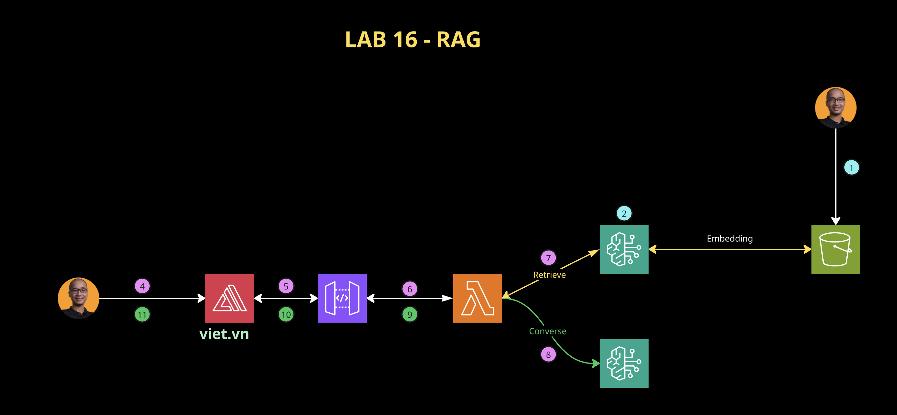
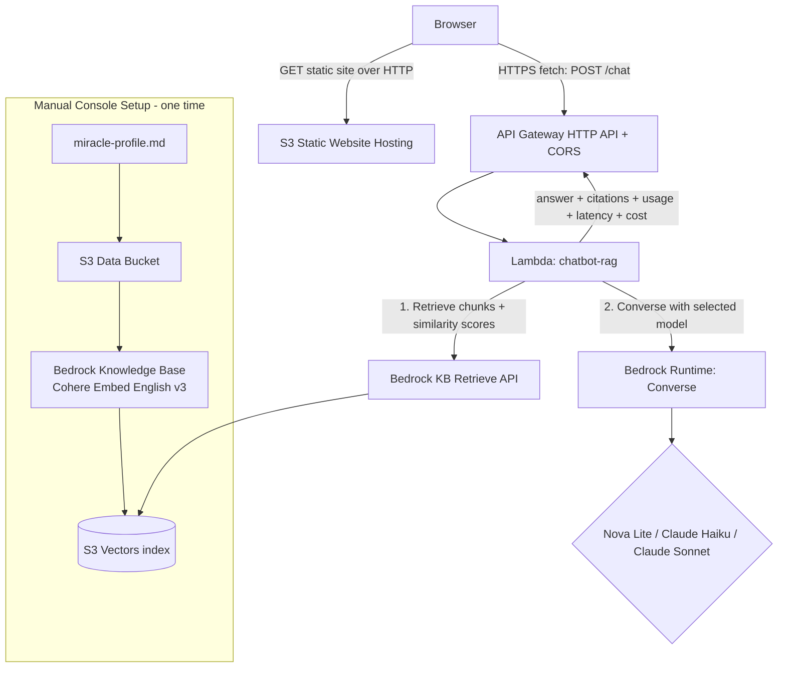

# Miracle RAG Chatbot on AWS (Bedrock Knowledge Base + S3 Vectors)

A demo Retrieval-Augmented Generation (RAG) chatbot that answers questions about
**Miracle Technologies** using its company profile. It runs on AWS native services:
Amazon Bedrock Knowledge Bases, Amazon S3 Vectors, AWS Lambda, Amazon API Gateway
(HTTP API), and an Amazon S3 static website for the frontend.

The chatbot lets a user **switch models** (Amazon Nova Lite, Claude Haiku, Claude
Sonnet) and shows **per-query learning metrics** (token-in / token-out, cost,
latency, tokens/sec, retrieval scores) so learners can compare models side by side.

- **Region:** `ap-southeast-1` (Singapore)
- **Deployment style:** Bedrock KB + S3 Vectors created **manually in the console**;
  Lambda, API Gateway, IAM created via **AWS CLI**; frontend hosted on **S3 static
  website hosting**.
- **RAG flow:** manual `Retrieve` (Bedrock KB) + `Converse` (Bedrock Runtime) so the
  app returns real token usage, latency, and lets each request pick a model.

> **Status:** This README is the agreed implementation **plan**. Tasks are listed in
> build order under [Implementation Plan](#implementation-plan). Each task produces a
> working, demoable increment.

---

## Architecture





### How it works

1. The browser loads the static frontend from the S3 website endpoint.
2. The user types a question and picks a model from the dropdown.
3. The frontend sends `POST /chat { message, modelId }` to the API Gateway HTTP API
   (HTTPS). CORS is configured for the S3 website origin.
4. The `chatbot-rag` Lambda:
   - calls Bedrock KB **`Retrieve`** to fetch the top relevant chunks + similarity
     scores from the S3 Vectors index,
   - builds a grounded prompt and calls Bedrock Runtime **`Converse`** with the
     user-selected model,
   - returns the answer plus metrics (token usage, latency, tokens/sec, estimated
     cost, retrieval scores, model + region).
5. The frontend renders the answer and updates the metrics panel.

### Request / response contract

**Request** — `POST /chat`
```json
{ "message": "What products does Miracle offer?", "modelId": "apac.amazon.nova-lite-v1:0" }
```

**Response**
```json
{
  "answer": "Miracle offers MiracleConnect, MiracleVault, MiracleFlow, MiracleInsight ...",
  "modelId": "apac.amazon.nova-lite-v1:0",
  "region": "ap-southeast-1",
  "usage": { "inputTokens": 812, "outputTokens": 143, "totalTokens": 955 },
  "latencyMs": 1840,
  "tokensPerSecond": 77.7,
  "retrieval": [
    { "uri": "s3://miracle-kb-data-123/miracle-profile.md", "score": 0.72 },
    { "uri": "s3://miracle-kb-data-123/miracle-profile.md", "score": 0.68 }
  ],
  "estimatedCostUsd": 0.00021
}
```

### Region note on model IDs

In `ap-southeast-1`, Nova and newer Claude models are typically invoked through
**cross-region inference profiles** (e.g. `apac.amazon.nova-lite-v1:0`,
`apac.anthropic.claude-3-haiku-...`, `apac.anthropic.claude-...-sonnet-...`) rather
than plain `foundation-model` ARNs. Confirm the exact inference profile IDs in the
Bedrock console (**Model catalog** / **Cross-region inference**) at build time and use
those in the Lambda allowlist and IAM policy.

> **Model enablement (Sep 2025+):** Bedrock removed the old **Model access** page.
> Serverless models are **auto-enabled** per Region; access is granted via IAM, plus an
> automatic AWS Marketplace subscription on first use of a third-party model (Anthropic
> Claude, Cohere) — which needs `aws-marketplace:Subscribe` + `ViewSubscriptions` on the
> calling role. Anthropic models also need a one-time First-Time-Use form. Amazon Nova
> needs neither.

### Hosting note (HTTP vs HTTPS)

S3 static website hosting serves over **HTTP**. The API Gateway endpoint is **HTTPS**.
A browser page served over HTTP is allowed to call an HTTPS endpoint via `fetch`, so
the demo works as-is. CloudFront (to serve the site over HTTPS) is an **optional**
upgrade, intentionally out of scope for this demo.

---

## Artifacts

Files and resources this project produces.

### Repository files

| Path | Type | Purpose |
|------|------|---------|
| `miracle-profile.md` | Source doc | The single RAG knowledge source (company profile). |
| `chatbot/lambda/rag/index.mjs` | Lambda code | Manual RAG handler: Retrieve + Converse, model switching, metrics. |
| `chatbot/frontend/index.html` | Frontend | Chat UI with model-selector dropdown + metrics panel. |
| `chatbot/frontend/app.js` | Frontend | HTTP `fetch` client, renders answers + metrics. |
| `chatbot/frontend/style.css` | Frontend | Styling for chat, dropdown, and metrics panel. |
| `scripts/deploy-lambda.sh` | CLI script | Creates IAM role, zips + deploys `chatbot-rag` Lambda. |
| `scripts/deploy-apigw.sh` | CLI script | Creates HTTP API, route, integration, CORS, Lambda permission. |
| `scripts/deploy-frontend.sh` | CLI script | Creates S3 website bucket, uploads frontend, prints URL. |
| `chatbot/DEPLOYMENT.md` | Runbook | Full console + CLI runbook (Singapore): KB + S3 Vectors setup, Lambda/API/frontend deploy, metrics explainer, troubleshooting, teardown. |

> The current `chatbot/lambda/connect` and `chatbot/lambda/default` WebSocket handlers
> are superseded by the single `chatbot/lambda/rag` HTTP handler and will be removed
> or archived during Task 3.

### AWS resources (created during deploy)

| Resource | Created by | Notes |
|----------|-----------|-------|
| S3 data bucket | Console (CLI alt) | Holds `miracle-profile.md`. |
| Bedrock Knowledge Base | **Console** | Cohere Embed English v3; vector store = S3 Vectors. |
| S3 Vectors bucket + index | **Console** (auto by KB) | Created by KB "quick create". |
| IAM role `ChatbotRagRole` | CLI | Bedrock invoke + KB retrieve + CloudWatch Logs. |
| Lambda `chatbot-rag` | CLI | Node.js 22.x, env `KNOWLEDGE_BASE_ID`. |
| API Gateway HTTP API `chatbot-http` | CLI | `POST /chat`, CORS, `prod` stage. |
| S3 website bucket | CLI | Static website hosting, public-read (demo only). |

---

## Implementation Plan

Build order. Each task is independently demoable.

### Task 1 — Confirm / finalize the Miracle profile
- Review `miracle-profile.md`; optionally add a short FAQ section to improve retrieval.
- Keep it a single Markdown file.
- **Done when:** each planned demo question has a supporting answer in the document.

### Task 2 — Create Bedrock KB + S3 Vectors (console runbook, ap-southeast-1)
- Confirm models in the **Model catalog** (serverless models are auto-enabled — no
  "Model access" step): Cohere Embed English v3 + the three chat models. (Titan
  embeddings are not available in ap-southeast-1.) Submit the Anthropic First-Time-Use
  form once for Claude.
- Create S3 data bucket, upload `miracle-profile.md`.
- Create Knowledge Base → embedding model Cohere Embed English v3 → vector store
  **S3 Vectors** (quick create) → sync.
- Capture the **Knowledge Base ID**.
- **Done when:** KB "Test" panel returns grounded answers for 2–3 sample questions.

### Task 3 — RAG Lambda (Retrieve + Converse, model switch, metrics)
- `chatbot/lambda/rag/index.mjs`: accept `{message, modelId}`; call `Retrieve` for
  chunks + scores; call `Converse` with the selected model; return answer, citations,
  token usage, latency, tokens/sec, estimated cost.
- Server-side model **allowlist** + price table for cost estimation. Read
  `KNOWLEDGE_BASE_ID` from env. Return JSON with CORS headers.
- **Done when:** console test event returns valid JSON with all metrics.

### Task 4 — CLI: IAM role + Lambda deploy (`scripts/deploy-lambda.sh`)
- Create `ChatbotRagRole` scoped to `bedrock:InvokeModel`, `bedrock:Converse`,
  `bedrock-agent-runtime:Retrieve` (+ APAC inference-profile ARNs), CloudWatch Logs.
- Zip + `create-function` (Node.js 22.x), set env `KNOWLEDGE_BASE_ID`, timeout/memory.
- **Done when:** `aws lambda invoke` returns 200 + valid JSON.

### Task 5 — CLI: API Gateway HTTP API (`scripts/deploy-apigw.sh`)
- `create-api --protocol-type HTTP` with CORS (`POST,OPTIONS`, `content-type`).
- Integration (AWS_PROXY) + `POST /chat` route + `lambda add-permission` + `prod` stage.
- **Done when:** `curl -X POST <url>/chat` returns answer + metrics; `OPTIONS` returns
  CORS headers.

### Task 6 — Frontend: model selector + metrics panel (HTTP fetch)
- Refactor `app.js` from WebSocket to `fetch(API_URL + '/chat', ...)`.
- Add dropdown (Nova Lite, Claude Haiku, Claude Sonnet) + metrics panel: input/output/
  total tokens, estimated cost, latency, tokens/sec, retrieved chunk count + top
  similarity scores, model name + region. Update `index.html` / `style.css`.
- **Done when:** each model returns an answer; switching models updates the metrics.

### Task 7 — CLI: S3 static website (`scripts/deploy-frontend.sh`)
- Create bucket, enable website hosting, public-read policy (demo caveat documented),
  inject API URL into `app.js`, `s3 sync` the frontend, print website endpoint.
- **Done when:** opening the S3 website URL runs the full demo across all three models.

### Task 8 — Runbook + metrics explainer (`DEPLOYMENT.md`)
- Consolidate Tasks 2–7 into one console+CLI runbook (Singapore).
- Add "Metrics explained" section + teardown steps.
- **Done when:** a fresh follow-through of the runbook reproduces the working demo.

---

## Demo Steps (end-to-end)

Run after the stack is deployed (Tasks 2–7 complete).

1. **Open the chatbot.** Browse to the S3 static website endpoint printed by
   `scripts/deploy-frontend.sh` (e.g. `http://miracle-chatbot-frontend-<acct>.s3-website-ap-southeast-1.amazonaws.com`).

2. **Ask a grounded question** with the default model (Nova Lite):
   > "What products does Miracle Technologies offer?"
   - Expect a grounded answer listing MiracleConnect, MiracleVault, MiracleFlow,
     MiracleInsight, and Professional Services.
   - Watch the **metrics panel**: input tokens, output tokens, total tokens, estimated
     cost, latency, tokens/sec, retrieved chunk count + top similarity scores.

3. **Switch the model** to **Claude Haiku**, ask the same question again.
   - Compare the metrics: Haiku vs Nova Lite token counts, latency, and cost.

4. **Switch to Claude Sonnet**, ask a reasoning-heavier question:
   > "What is Miracle planning to do with its Series A funding, and how does that tie
   > to its 2026–2027 strategic objectives?"
   - Observe a richer answer, higher output tokens, higher cost, and the retrieval
     scores backing it.

5. **Test retrieval quality** with targeted prompts:
   - "What was Miracle's revenue in FY 2025?" → revenue table
   - "What cloud infrastructure does Miracle use?" → highlights section
   - "Does Miracle have any certifications?" → ISO 27001, PCI DSS

6. **Show the learning takeaway:** same question, three models → compare
   token-in/token-out, cost, and latency to reason about the cost/quality/speed
   trade-off of RAG model selection.

7. **(Optional) CLI smoke test** of the API directly:
   ```bash
   curl -s -X POST "$API_URL/chat" \
     -H 'content-type: application/json' \
     -d '{"message":"What markets does Miracle operate in?","modelId":"apac.amazon.nova-lite-v1:0"}' | jq
   ```

8. **Teardown** (avoid charges) per `DEPLOYMENT.md`: delete KB (with data-deletion
   policy), S3 Vectors bucket, data bucket, Lambda, HTTP API, website bucket, IAM role.

---

## Metrics shown in the UI

| Metric | Meaning |
|--------|---------|
| Input tokens | Tokens sent to the model (prompt + retrieved context). |
| Output tokens | Tokens generated in the answer. |
| Total tokens | Input + output. |
| Estimated cost (USD) | Per-model price-per-1K-tokens × tokens, computed server-side. |
| End-to-end latency (ms) | Time from request receipt to full response in the Lambda. |
| Tokens / second | Output tokens ÷ generation time — throughput indicator. |
| Retrieved chunks | How many KB chunks were used to ground the answer. |
| Top similarity scores | Relevance scores of the retrieved chunks (0–1). |
| Model / region | Which model answered and in which AWS region. |

**Optional stretch metrics** (teachable, can add later): time-to-first-token,
retrieval-latency vs generation-latency split, cumulative session cost, per-model cost
comparison for the same question, and a grounded-vs-ungrounded indicator.
